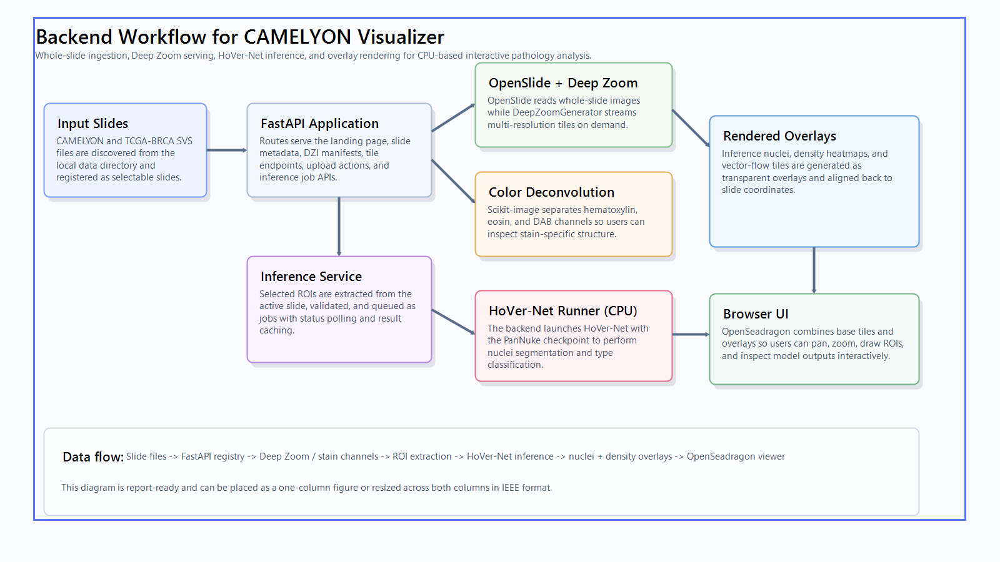

# MM804 Project: Heatmap Visualization of CAMELYON and TCGA-BRCA WSIs

This project provides a full-stack web application for visualizing whole-slide images (WSI), running cell segmentation/classification inferences (via HoVer-Net), and visualizing the results through density heatmaps and vector overlays. The current setup supports representative dataset slides from both CAMELYON and TCGA-BRCA.



## Getting Started: Step-by-Step Guide

Follow these instructions carefully to get the project up and running. The codebase relies on an external repository (HoVer-Net) and its downloaded model weights to perform WSI inference correctly.

### Step 1: Clone this Repository
Clone this main project directory to your local machine:
```bash
git clone https://github.com/sushmitabajgain/Heatmap-and-Vector-Flow-Visualization-of-CAMELYON-Whole-Slide-Images.git
cd "Heatmap-and-Vector-Flow-Visualization-of-CAMELYON-Whole-Slide-Images"
```

### Step 2: Download HoVer-Net and Required Model
To keep this repository lightweight, the HoVer-Net source code and its multi-gigabyte models are not included. The server uses a background process running HoVer-Net via Conda.

1. **Clone HoVer-Net Source Code:**
   Inside the root of this project, you must clone the `hover_net` repository. Ensure the folder is named **exactly** `hover_net`:
   ```bash
   git clone https://github.com/vqdang/hover_net.git hover_net
   ```

2. **Download the Pre-Trained Model Weights:**
   The specific model you need is the **Fast PanNuke (PyTorch) model**.
   - **Download Link**: Go to the [HoVer-Net Pretrained Models section](https://github.com/vqdang/hover_net#pretrained-models) (or directly via their provided Google Drive links in their README).
   - **File Name**: You are looking for a file named exactly: `hovernet_fast_pannuke_type_tf2pytorch.tar`.
   - **Where to put it**: Once downloaded, place this `.tar` file directly inside the `hover_net/` folder.
   - **Important**: Keep `hover_net/type_info.json` in place as well, since the app checks it before enabling HoVer-Net inference.
   
   Your directory structure should look like this:
   ```
   MM804 Project/
   ├── hover_net/
   │   ├── hovernet_fast_pannuke_type_tf2pytorch.tar   <-- Must be here!
   │   ├── type_info.json
   │   ├── environment.yml
   │   ├── requirements.txt
   │   └── ...
   ├── server/
   ├── web/
   └── Dockerfile
   ```

### Step 3: Add Sample WSI Data
You can run the project with two dataset slides: one CAMELYON WSI and one TCGA-BRCA WSI.

1. **CAMELYON WSI:** Download `622949.svs` from the shared Google Drive folder:
   `https://drive.google.com/file/d/11uMmQcCq2Nak3SO2Uu2mfeNJqxwEjWXx/view?usp=share_link`
2. **Place the CAMELYON Slide:** Move the downloaded `.svs` file into the `data/` directory.
3. **TCGA-BRCA WSI:** Place the following file in the uploads/data area as well:
   `TCGA-OL-A5RW-01Z-00-DX1.E16DE8EE-31AF-4EAF-A85F-DB3E3E2C3BFF.svs`

```bash
mkdir -p data
# Place the CAMELYON slide here:
# data/622949.svs
# Place the TCGA-BRCA slide here:
# data/uploads/TCGA-OL-A5RW-01Z-00-DX1.E16DE8EE-31AF-4EAF-A85F-DB3E3E2C3BFF.svs
```

### Step 4: Run the Application Using Docker (Recommended)
Because the codebase requires both a Python 3.10 environment (for FastAPI) and a separate Conda environment for HoVer-Net, using Docker is by far the easiest way to launch the app safely without cluttering your system.

1. Install [Docker Desktop](https://www.docker.com/products/docker-desktop/).
2. Make sure Docker Desktop is fully running before starting the app.
3. From the root of the project, run:
   ```bash
   docker compose up --build
   ```
   *(Note: The first time this is run, it will take several minutes to download Miniconda, create the `hovernet` conda environment, and install all required packages.)*

### Step 5: Test the WSI Pipeline
To verify everything is working:
1. Open your browser and go to [http://localhost:8000/](http://localhost:8000/).
2. You will see the application interface.
3. Select one of the available dataset slides from the gallery. When both files are present, you should see the CAMELYON WSI and the TCGA-BRCA WSI in the interface.
4. Open the **Analyze** tab and use **"Draw ROI"** to drag a rectangular inference region, or simply leave it unset to use the current viewport.
5. Choose **HoVerNet (PanNuke)** and set the device to **CPU** if you are running on a laptop without GPU acceleration.
6. Click **"Run Inference"**. This will automatically process the selected region or the region currently visible on your screen.
7. You will see a progress bar. The server is extracting the patch and running `hover_net` in the background.
8. Once completed, toggle the **"Inference Results"**, **"Cell Density Heatmap"**, or **"Show Flow Vectors"** overlays. You should clearly see the cellular segmentation contours and density mapping.

**CPU Note:** Inference works on CPU, but it is slower than GPU-based execution. For the best experience, draw a smaller ROI instead of analyzing a large whole-slide region.

---

## Running Locally (Without Docker)

If you must run the application natively on your OS, perform these steps:

**1. Install System level Dependencies:**
- **macOS (via Homebrew):** `brew install openslide`
- **Ubuntu/Debian:** `sudo apt-get install openslide-tools libgl1 libglib2.0-0`

**2. Setup the `hovernet` Conda Environment (For Inference):**
Ensure you have Conda/Miniconda installed.
```bash
cd hover_net
conda env create -f environment.yml
cd ..
```

**3. Setup the Main FastApi Environment (For Web Server):**
Create a separate standard virtual environment (Python 3.10+):
```bash
python -m venv venv
source venv/bin/activate
pip install -r requirements.txt
```

**4. Start the Application Server:**
With your `venv` active, run:
```bash
uvicorn server.app:app --host 0.0.0.0 --port 8000 --reload
```
Access the application at `http://localhost:8000/`.

---

## Troubleshooting

### HoVer-Net is disabled or missing
If `HoVerNet (PanNuke)` does not appear as available in the UI:
- confirm `hover_net/` exists in the project root
- confirm `hovernet_fast_pannuke_type_tf2pytorch.tar` is inside `hover_net/`
- confirm `hover_net/type_info.json` exists
- restart the app after adding missing files

### Docker app is not running
If `http://localhost:8000/` does not open:
- start Docker Desktop first
- rerun `docker compose up --build`
- wait until the server fully starts before refreshing the page

### CPU inference is too slow
If inference is taking too long:
- draw a smaller ROI
- avoid analyzing the entire viewport at once
- start with either dataset slide and zoom into a focused tissue area first
- the TCGA-BRCA WSI is smaller and can be useful for quicker test runs before using larger CAMELYON regions

### Slides are not showing in the UI
If the gallery is empty:
- confirm your `.svs` files are in the expected data folders
- check that the server started without slide-loading errors
- verify the slide list through `http://localhost:8000/api/slides`

---

## Additional Notes

- The project currently uses two dataset slides: `622949.svs` from CAMELYON and `TCGA-OL-A5RW-01Z-00-DX1.E16DE8EE-31AF-4EAF-A85F-DB3E3E2C3BFF.svs` from TCGA-BRCA.
- Both slides use the same gallery, viewing, ROI selection, HoVer-Net inference, and overlay workflow.
- This project has been tested in a CPU-based setup, so the documented inference flow is suitable for laptop use with smaller ROIs.
